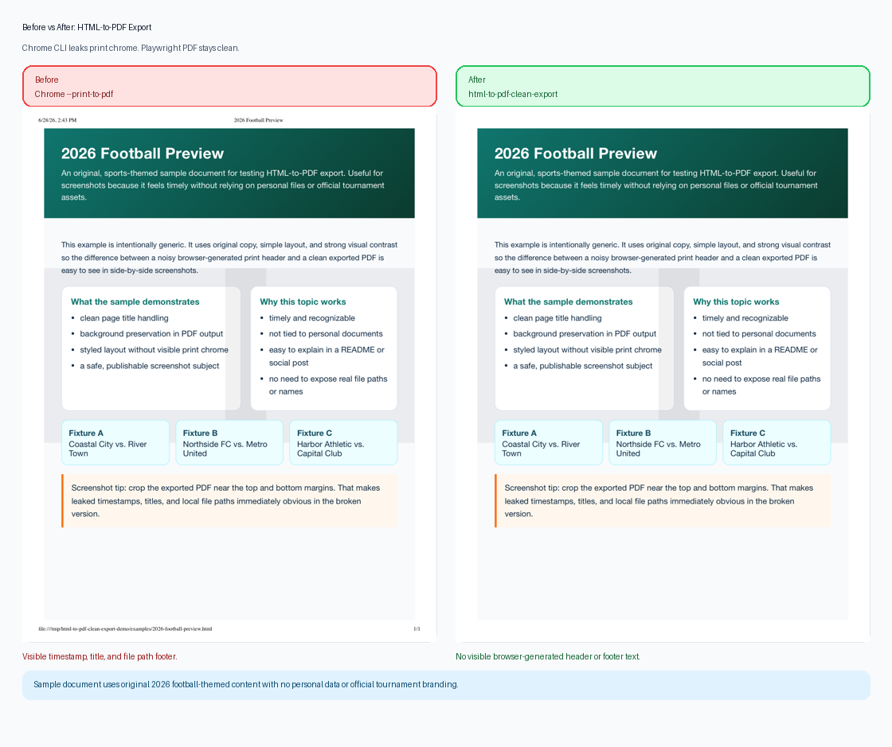

# No-Leak HTML to PDF Export

A small Playwright-based utility for producing clean, privacy-safe PDFs from HTML.

Chrome's CLI print-to-PDF flow can leak unwanted browser-generated content into exported PDFs, including timestamps, page titles, and local file paths. This project provides a simple, reusable HTML-to-PDF export path built on Playwright's PDF API so generated files stay clean, predictable, and suitable for professional or public-facing use.

It is designed for people generating resumes, portfolios, reports, application packets, invoices, and other HTML-based documents where stray header or footer text is unacceptable.

## Before vs After

Chrome's CLI PDF export can leak print header and footer content into generated documents, including timestamps, page titles, and local file paths.

**Before:** `Chrome --print-to-pdf`  
Visible timestamp or title in the header and a local `file:///...` path in the footer.

**After:** `html-to-pdf-clean-export`  
Clean PDF output with no visible browser-generated header or footer text.

Use a safe example asset for screenshots. A good option is the included sports-themed sample, which feels current without using personal files or official tournament branding.



## Why This Exists

A common HTML-to-PDF workflow is to use Chrome in headless mode with flags like `--print-to-pdf`, `--print-to-pdf-header-template=""`, and `--print-to-pdf-footer-template=""`.

That looks correct, but in practice the exported PDF can still show browser-generated print content such as:

- timestamps
- page titles
- local `file:///...` paths
- other unwanted header or footer text

This utility avoids that failure mode by using Playwright's PDF API directly.

## Features

- Exports one or more HTML files to PDF
- Suppresses visible browser-generated headers and footers
- Preserves backgrounds and styling
- Supports explicit HTML-to-PDF file mappings
- Produces predictable output suitable for automation workflows

## Requirements

- Python 3.9+
- Playwright
- A local Chrome or Chromium executable

## Installation

Install dependencies:

```bash
pip install -r requirements.txt
```

Or install as a local package:

```bash
pip install .
```

## Usage

Run the script directly:

```bash
python export_html_to_pdf.py \
  --chrome "/Applications/Google Chrome.app/Contents/MacOS/Google Chrome" \
  --mapping "/absolute/path/to/input.html=/absolute/path/to/output.pdf"
```

Multiple files:

```bash
python export_html_to_pdf.py \
  --chrome "/Applications/Google Chrome.app/Contents/MacOS/Google Chrome" \
  --mapping "/absolute/path/to/resume.html=/absolute/path/to/resume.pdf" \
  --mapping "/absolute/path/to/cover-letter.html=/absolute/path/to/cover-letter.pdf"
```

Installed CLI:

```bash
html-to-pdf-clean-export \
  --chrome "/Applications/Google Chrome.app/Contents/MacOS/Google Chrome" \
  --mapping "/absolute/path/to/input.html=/absolute/path/to/output.pdf"
```

## Example

Generate sample output from the included examples:

```bash
python export_html_to_pdf.py \
  --chrome "/Applications/Google Chrome.app/Contents/MacOS/Google Chrome" \
  --mapping "examples/basic-example.html=output/basic-example.pdf" \
  --mapping "examples/styled-report-example.html=output/styled-report-example.pdf"
```

## Privacy Note

If you use browser CLI print flows incorrectly, exported PDFs can reveal:

- local filesystem paths
- timestamps from your machine
- page titles you did not intend to publish

This utility reduces that risk at export time. You should still review output PDFs before sharing them publicly.

## Project Structure

```text
html-to-pdf-clean-export/
  README.md
  .gitignore
  pyproject.toml
  requirements.txt
  export_html_to_pdf.py
  examples/
    basic-example.html
    styled-report-example.html
    2026-football-preview.html
  docs/
    why-not-chrome-cli.md
    screenshot-guide.md
  output/
    .gitkeep
```

## Why Not Chrome CLI?

See [docs/why-not-chrome-cli.md](docs/why-not-chrome-cli.md) for the failure mode this project is designed to avoid.

## License

Add the license you want before publishing, such as MIT.
